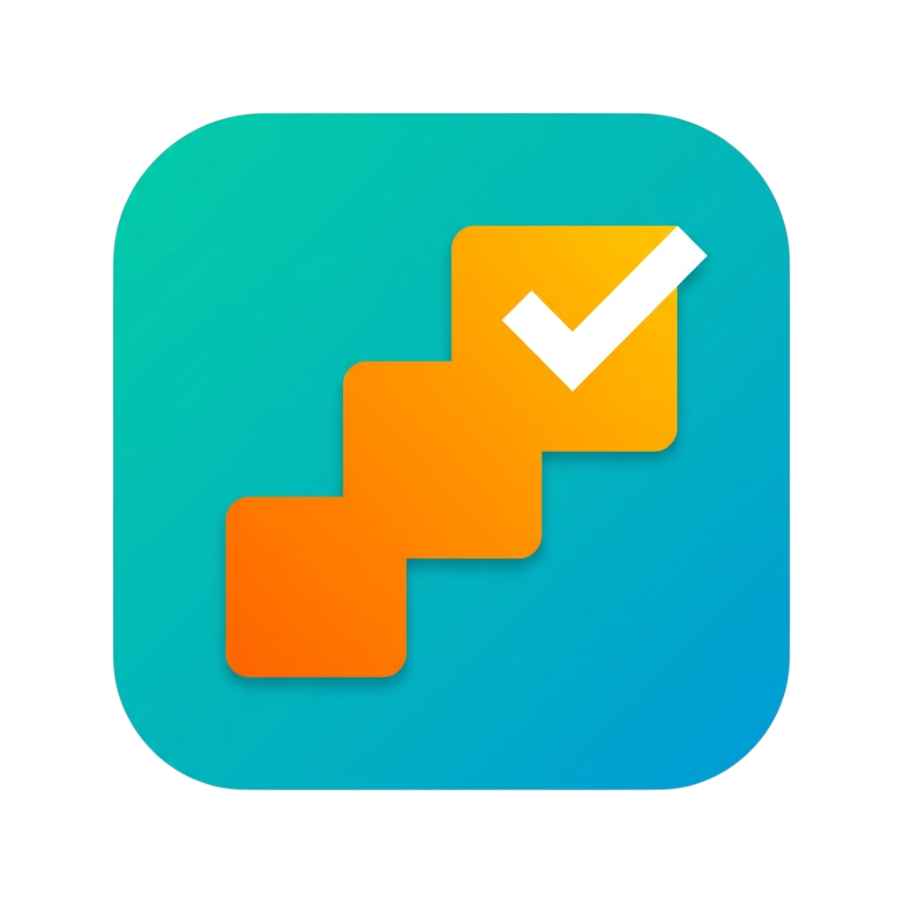
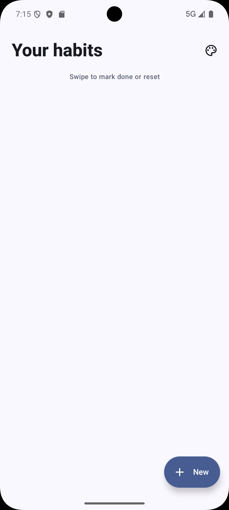
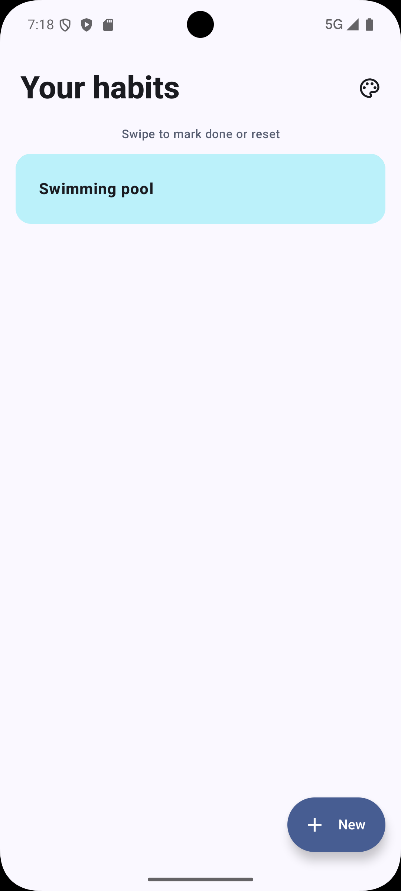
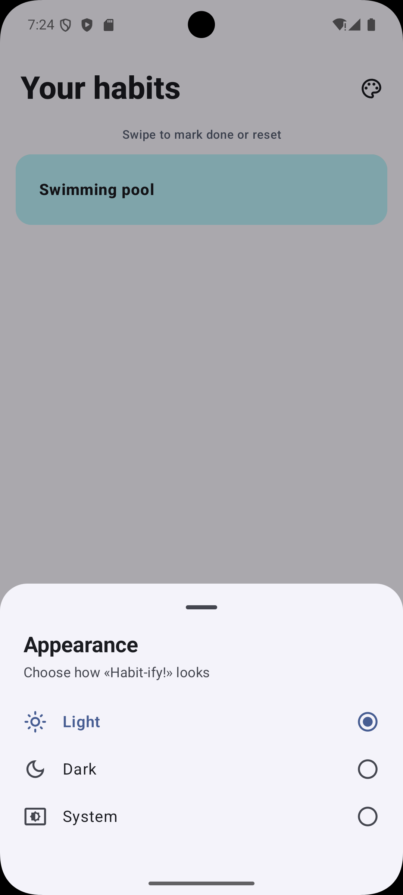
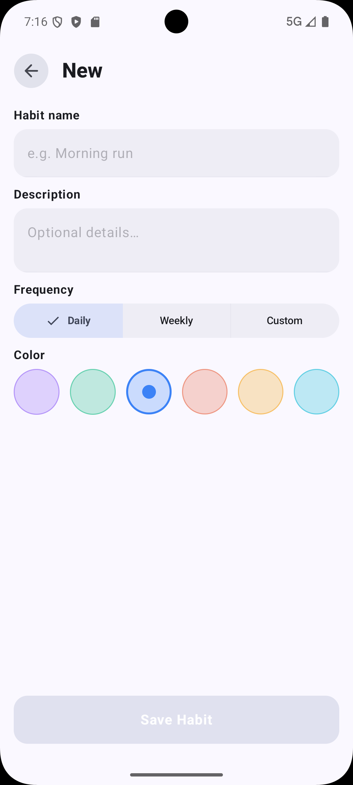
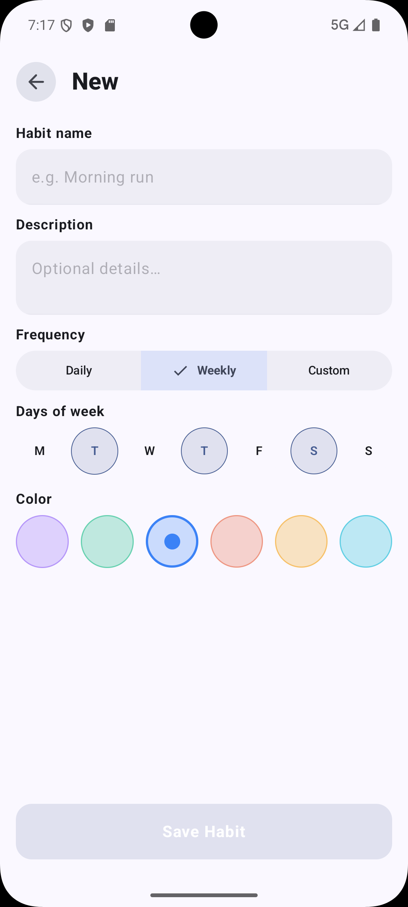
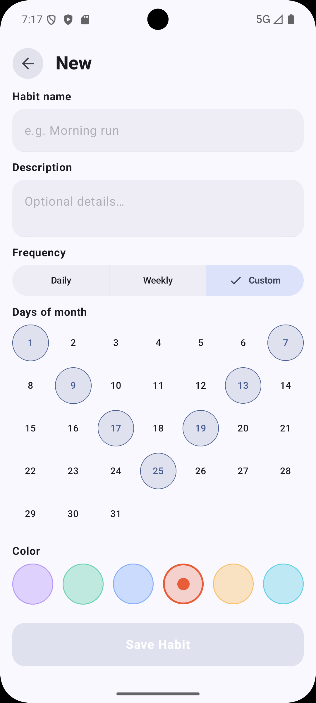
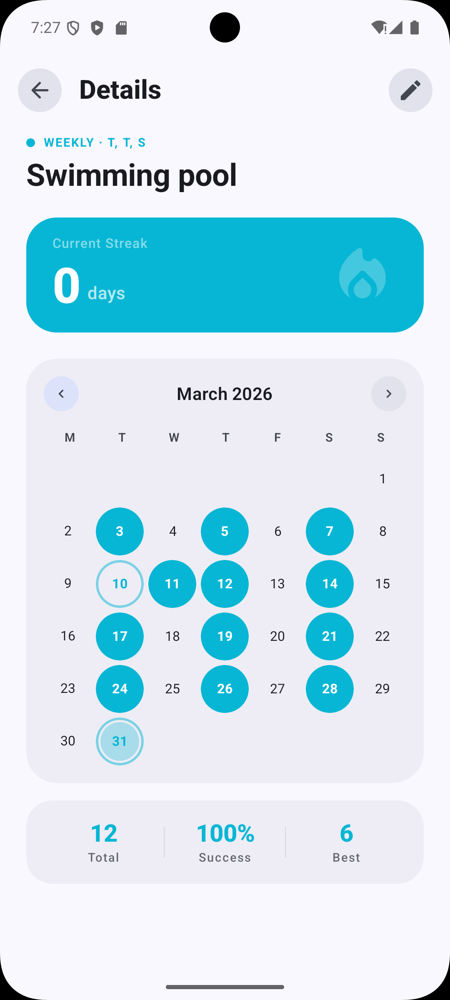
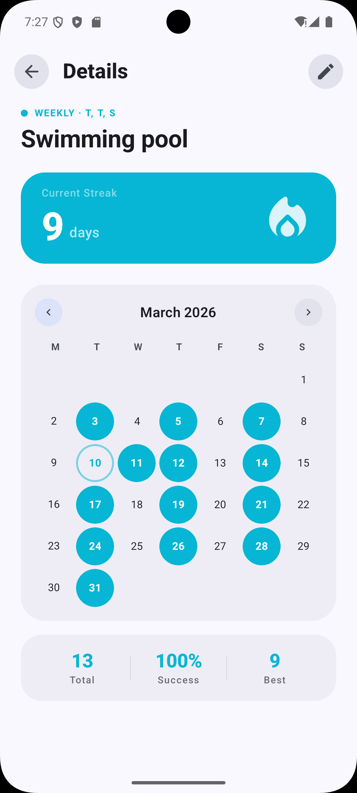
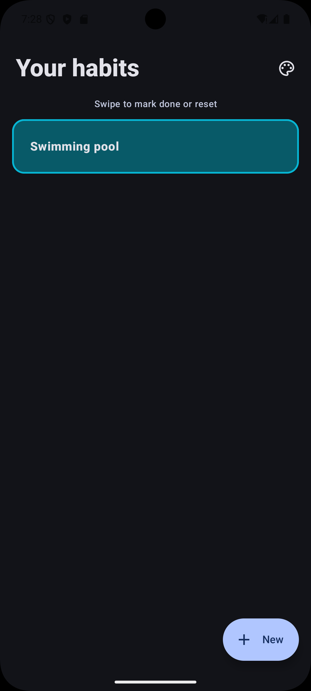

# Habit-ify

An Android habit tracker for creating recurring habits, marking them complete, and reviewing progress through streaks, stats, and a calendar view.

[](https://www.rustore.ru/catalog/app/com.dyusov.habit_ify)[](https://github.com/meekieD/Habit-ify/releases/latest/download/Habitify_1.0.0.apk)

## Overview

I built Habit-ify to solve a small but common UX problem: most habit trackers handle "do this every day" well, then get awkward when a habit should happen only on certain weekdays or specific dates each month.

This project was also a deliberate architecture exercise. I wanted a portfolio app that shows how I structure a modern Android codebase when the goal is maintainability, not just shipping a screen quickly. That meant splitting features into modules, keeping business rules out of the UI layer, and using dependency injection and reactive state end to end.

The app is fully local today. Habit data is stored on-device with Room, which keeps the interaction fast and makes the project a clean example of an offline-first Android app without backend noise.

## Screenshots

<p>
  
  
  
</p>

<p>
  
  
  
</p>

<p>
  
  
  
</p>

## What It Does

- Create habits with a name, optional description, color, and recurrence pattern.
- Support daily habits, weekly habits on selected weekdays, and custom habits on selected days of the month.
- Show all habits in a single agenda screen where completion can be toggled with swipe gestures.
- Open a details screen for a single habit with a month calendar, current streak, best streak, total completions, and success rate.
- Persist app theme preference with system, light, and dark modes.

## Feature Highlights

### 1. Flexible recurrence rules

The habit model uses a sealed `HabitFrequency` hierarchy with `Daily`, `Weekly`, and `Custom` variants. That keeps the rules explicit in the domain layer instead of scattering special cases across screens.

Why it matters: adding a new schedule type becomes a domain change first, not a UI rewrite.

### 2. Swipe-to-complete agenda

The agenda screen is built in Compose and uses `SwipeToDismissBox` to toggle completion directly from the list. Completion state is derived from habit data plus completion history coming from the data layer, not from ad hoc UI flags.

Why it matters: the interaction feels fast, while the state still comes from a single source of truth.

### 3. Habit details with calendar-driven progress

Each habit has a details screen with:

- a tappable monthly calendar
- current and best streak calculations
- total completions
- a simple success-rate metric

The interesting part is that these numbers are not UI-only computations. Streak logic lives in the domain layer, with separate calculators for daily, weekly, and monthly-style schedules.

Why it matters: the rules are isolated, reusable, and much easier to test than if they lived inside a composable.

### 4. Theme persistence across launches

Theme mode is stored in DataStore and exposed through a dedicated repository and `ThemeViewModel`. The agenda screen lets the user switch between light, dark, and system modes, and that preference survives app restarts.

Why it matters: it is a small feature, but it shows app-wide state management, persistence, and Compose-driven theming working together cleanly.

## Technical Stack

### Jetpack Compose

I chose Compose because this app is almost entirely state-driven: agenda lists, form state, animated stats, and calendar interactions all map naturally to declarative UI. It also let me keep feature UI self-contained inside each module.

### Clean Architecture + MVVM

The codebase is split into `app`, `core:*`, and `feature:*` modules. Features expose navigation APIs separately from implementations, and ViewModels coordinate use cases rather than reaching straight into Room.

I used this structure to keep responsibilities clear:

- Compose screens render state and emit user intents
- ViewModels translate intents into commands
- use cases hold business operations
- repositories hide persistence details

That separation matters in a project like this because recurrence logic, streak calculation, and completion toggling should remain stable even if the UI changes.

### Coroutines and Flow

Room exposes reactive streams, and the app uses `Flow`, `StateFlow`, `SharedFlow`, `combine`, and `flatMapLatest` to keep the UI synchronized with local data. Coroutines handle async database operations without callback plumbing.

I chose coroutines here because they make "observe state, react to user input, recalculate derived data" straightforward and readable.

### Hilt

Hilt wires up the database, DAOs, repositories, date/time provider, and theme storage. It also supports assisted injection for ViewModels that need runtime arguments such as `habitId`.

I used Hilt to make dependencies explicit and replaceable. In practice, that means feature modules stay focused on behavior instead of object construction.

### Supporting libraries

- Room for local persistence and reactive DAO access
- DataStore for persisted theme preference
- Kotlinx DateTime for date-safe recurrence and streak logic
- Material 3 for Compose UI components and adaptive styling
- Navigation 3 for back stack and feature entry composition

## Project Structure

```text
app/
core/
  common/        shared result/date utilities
  data/          repository implementations + DI bindings
  database/      Room database, entities, DAOs, schema export
  domain/        use cases and streak calculation logic
  designsystem/  theme state and persistence
  model/         domain models
  ui/            reusable UI primitives
feature/
  habit-agenda/
    api/
    impl/
  habit-add-edit/
    api/
    impl/
  habit-details/
    api/
    impl/
```

The `api`/`impl` split is intentional. It keeps navigation contracts and feature integration points slim while letting implementation details evolve independently.

## How to Run

### Prerequisites

- Android Studio with Android SDK 36 installed
- JDK 11 or newer
- An emulator or physical device running Android 8.0+ (API 26+)

### Build and launch

1. Clone the repository.
2. Open the project in Android Studio.
3. Let Gradle sync and confirm the IDE is using JDK 11+.
4. Build the debug app:

```bash
./gradlew :app:assembleDebug
```

On Windows, use:

```powershell
.\gradlew.bat :app:assembleDebug
```

5. Install to a connected device or emulator:

```bash
./gradlew :app:installDebug
```

6. Launch the app from the device, or press Run in Android Studio.

Expected output:

- a debug APK at `app/build/outputs/apk/debug/app-debug.apk`
- the app opens on the habit agenda screen

### Useful verification commands

```bash
./gradlew testDebugUnitTest
./gradlew lint
./gradlew build
```
